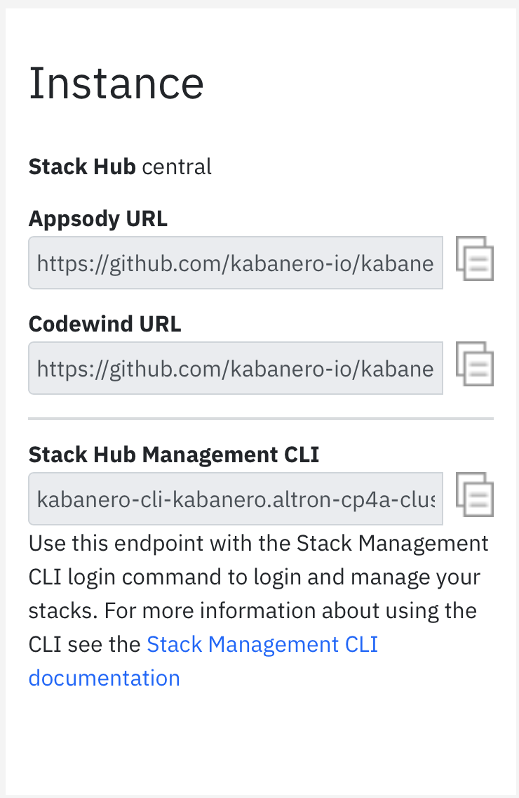

# Springboot on OC using appsody and tekton 

This is guide to create a sample app using appsody and tekton pipelines.

# Pre Req

1. Install appsody cli 
2. Install Docker
3. Have a openshift cluster 4.x
4. Install CPA on 4.x cluster

# Steps

1. Add kabaanero repo to appsody from cp4a 
```
$ appsody repo add kabanero <url>
```



2. list what it is in ```kabanero``` repo 

```
$ appsody list 
```

3. Make ```kabanero``` repo as default 
```
$ appsody repo set-default kabanero
```

4. Create a new folder and navigate to it 
```
$ mkdir sample
$ cd sample
```

5. Init the project 
```
$ appsody init kabanero/java-spring-boot2
```

6. Build the appsody project 
```
$ appsody build
```

7. Appsody test, running test 
```
$ appsody test
```

8. Run the application locally 

```
$ appsody run
```

9. Developer can access apis architect has built by default 

* Health endpoint: http://localhost:8080/actuator/health
* Liveness endpoint: http://localhost:8080/actuator/liveness
* Metrics endpoint: http://localhost:8080/actuator/metrics
* Prometheus endpoint: http://localhost:8080/actuator/prometheus

10. To stop Appsody 

```
$ appsody stop
```

11. Login to Openshift cluster through CLI

12. Create a new project 

```
$ oc new-project <yournamespace>
```

13. Navigate to the project 

```
$ oc project <name>
```

Here we will use the name as ``` kabanero-samples ```

14. edit kabanero and add your newly created namespace

```
$ oc edit kabanero kabanero -n kabanero
```

```
spec:
  targetNamespaces:
    - kabanero-samples
```

15. edit ```app-deploy.yaml``` file and give a namespace of yours which is ```kabanero-samples```

16. Go to Github and create a new repo, and get access token and save it somewhere
Follow these steps 

* Go to Github Settings.
* Select Developer settings.
* Click on Personal access tokens.
* Select Generate new token.
* Create a Github access token with permission admin:repo_hook